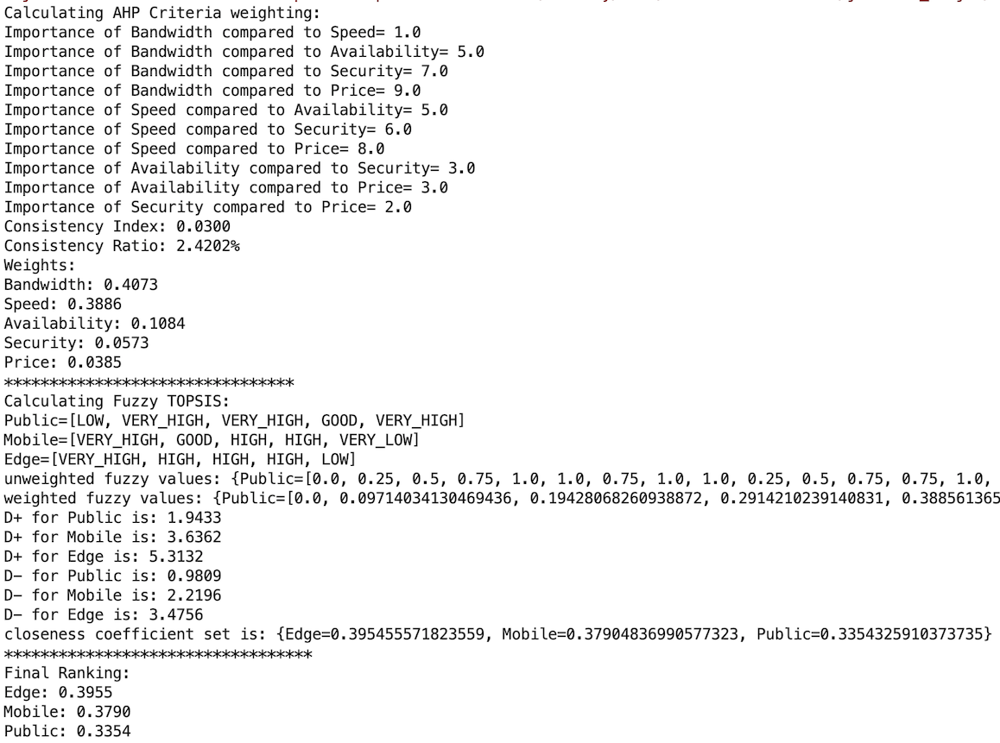

# AHP Fuzzy TOPSIS

This tool is used as a comprehensive multi-criteria approach to find the best ranking among the alternative suppliers.

## Usage
1. Make sure you have [Apache Math library](http://commons.apache.org/proper/commons-math/download_math.cgi) in your classpath
2. Edit the fields in [Config](./src/main/java/Config.java)
3. For a single decision maker: Compile and Run [Test](./src/main/java/Test.java). Multiple decision makers: [TestGroupDecisionMaking](./src/main/java/TestGroupDecisionMaking.java)

Output : 

## Learn
[AHP](https://en.wikipedia.org/wiki/Analytic_hierarchy_process)

[TOPSIS](https://en.wikipedia.org/wiki/TOPSIS)

In Fuzzy TOPSIS, Triangular Fuzzy set is applied into the proposed model to handle the vagueness. The interdependencies between criteria are considered.

## Related projects
This utility is used in offloading decision engine module in [MAMoC](https://github.com/dawand/MAMoC-Android)
